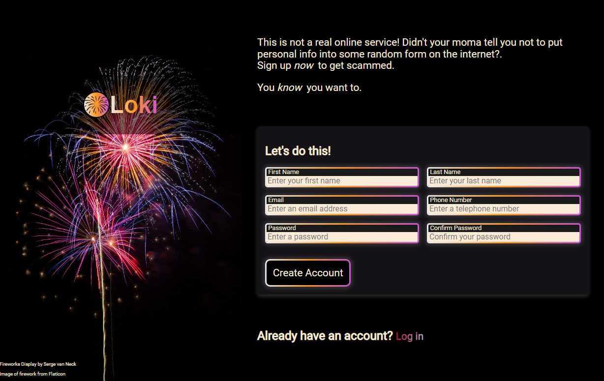

# Sign-up Form

A basic form built with JS, HTML & CSS. Designed to be responsive on desktop, tablet and mobile. Makes use of HTML validation and the JS Constraint Validation API.

[Demo here](https://casssb.github.io/sign-up-form/)

## Thoughts
I'm now more familiar with using CSS dynamic width & height properties to make everything responsive. I've some experience dealing with forms from doing the FreeCodeCamp Responsive Web Design course a while back so the rest of this project came together pretty quickly. I'm trying to make sure the visual design of my products has a decent amount of contrast and is consistent going forward.

## Possible Improvements
* Originally, I built a seperate div element into the form section which showed a custom error message to guide the user through entering passwords. I chose to remove it and just give visual indicators and rely on the basic HTML validation custom message. I felt that this was better from a style perspective but I don't think it's better from an overall user experience so may go back and change this at some point. I could make use of Javascript to include messages under each form element to make it extra clear for users.
* I spent a fair bit of time reading up on Firebase and would like to hook up some form of a basic backend to this. I've looked a little further into the curriculum I’m following and since this is covered at a later point, I left off doing this.
* I was reading a fair bit into SEO optimisation and compressing images. I've noticed via the browser dev tools that my image takes a fair amount of time (at least relatively) to load. I may come back to this at a later date and try to make it more optimal.
* I could have made more use of CSS dynamic functions like clamp, calc, min & max rather than using media queries.
* Although I tried to use semantic HTML where relevant I’m sure there’s more I could be doing from an accessibility point. I did not make use of ARIA or landmarks which is something I’ll be sure to do in future.
